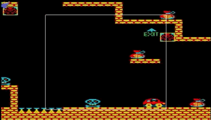
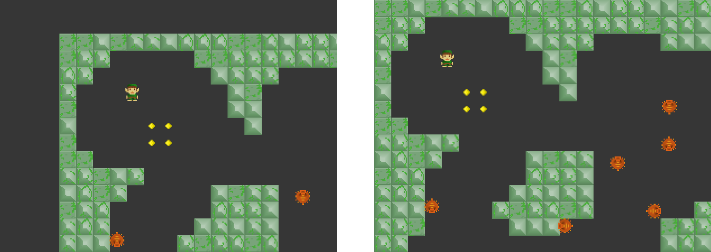

# Scrolling y operaciones con la cámara

Scrolling significa que el movimiento de la cámara sigue al personaje. En Haxeflixel el scrolling se puede hacer de la siguiente forma.

```haxe
FlxG.camera.follow(sprite);
```

La clase **FlxG** tiene el atributo *camera* que representa la camara principal del juego. El objeto *camera* tiene un método [*follow()*](http://api.haxeflixel.com/flixel/FlxCamera.html#follow) que recibe como argumento el objeto al cual la cámara debe seguir.
Además, como segundo argumento opcional, el método *follow()* puede recibir un estilo de seguimiento. Por ejemplo:

```haxe
FlxG.camera.follow(sprite, TOPDOWN);
```

Existen varios [tipos predefinidos de scrolling](http://api.haxeflixel.com/flixel/FlxCameraFollowStyle.html):

* **LOCKON**: El estilo por defecto. La cámara no posee zona muerta (dead zone), simplemente sigue al objeto de manera directa.
* **PLATFORMER**: La cámara tiene una zona muerta rectangular angosta y alta. Útil en videojuegos de plataformas para evitar el movimiento excesivo de la cámara al saltar.
* **TOPDOWN**: La cámara tiene una zona muerta cuadrada, de tamaño medio, enfocada en el objeto.
* **TOPDOWN_TIGHT**: La cámara tiene una zona muerta cuadrada, de tamaño pequeño, enfocada en el objeto.
* **SCREEN_BY_SCREEN**: La cámara se moverá dando saltos de una pantalla completa.

La zona muerta es una región cuadrada o rectangular dentro de la cual el objetivo de la cámara podrá moverse sin producir un desplazamiento de esta última. Cuando el objetivo trate de moverse fuera de la zona muerta, la cámara se desplazará para evitar que quede fuera como se observa en la siguiente imagen. El objetivo de utilizar una zona muerta es evitar el movimiento excesivo de la cámara, ya que éste puede producir mareos o resultar confuso.




## Scrolling y los bordes de la escena

Cuando la cámara sigue al objetivo, es importante que se detenga donde finaliza la zona jugable. De lo contrario la camara puede mostrar zonas que que se encuentran fuera del territorio de juego como se puede ver en la primera de las siguientes imágenes. Esto produce un efecto desagradable y desaprovecha espacio en la pantalla.



Existen funciones que permiten especificar los límites del escenario para evitar que la camara salga fuera al seguir al objetivo. Una de esllas es [*setScrollBoundsRect()*](http://api.haxeflixel.com/flixel/FlxCamera.html#setScrollBoundsRect), que se puede invocar de la siguiente manera.

```haxe
FlxG.camera.setScrollBoundsRect(0, 0, 1300, 1200, true);
```

Los dos primeros argumentos de la llamada corresponden a los valores mínimos para *x* e *y*, mientras que los dos siguientes corresponden al ancho y alto de la zona de juego (en este caso una zona de juego de 1300x1200 px).

El último argumento es muy importante. El valor *true* especifica que se deben actualizar las dimensiones del quad-tree global para coincidir con el tamaño especificado de la zona de juego. El quad-tree global es la estructura utilizada por el motor para la detección de colisiones entre objetos. El tamaño del mismo, inicialmente, coincide con el tamaño de la pantalla. Cuando creamos escenarios mas grandes que la zona visible, es necesario actualizar el tamaño del quad-tree para que la detección de colisiones funcione de manera correcta fuera de la zona inicial de la cámara.   

## Otras opciones de FlxCamera

Existen varias opciones para modificar el comportamiento de la cámara. Algunas de ellas son:

* [*followLerp*](http://api.haxeflixel.com/flixel/FlxCamera.html#followLerp): suaviza el movimiento de la cámara introduciendo una breve demora en el seguimiento. El valor del atributo varía entre 0 y 1, indicando el primer valor que la cámara no se mueve y el segundo que sigue al objeto sin suavizado. Un valor de 0.5 indica un suavizado medio. Ejemplo de uso:
```haxe
FlxG.camera.followLerp = 0.5;
```

* [*followLead*](http://api.haxeflixel.com/flixel/FlxCamera.html#followLead): se utiliza para forzar el enfoque de la cámara de manera que se adelante al movimiento del objetivo. Esto puede ser útil cuando el objetivo se mueve rápidamente y se desea enfocar la porción del nivel hacia donde se dirige. Se utiliza la velocidad del objetivo para el cálculo y la intensidad del efecto depende de la misma, además del valore del atributo. Ejemplo de uso 

```haxe
FlxG.camera.followLead.set(1, 1);
```

## Demo de FlxCamera

Para observar y experimentar con distintos valores para las funcionalidades mencionadas anteriormente, se recomienda dar un vistazo al [demo de **FlxCamera**](https://haxeflixel.com/demos/FlxCamera/)

## Parallax Scrolling

Parallax Scrolling es una técnica que consiste en superponer varias capas de imágenes y moverlas a velocidades diferentes para lograr un efecto de profundidad. La técnica fue ampliamente utilizadas en juegos de la era de las consolas como el que se muestran en la siguiente imagen.


Una forma sencilla de lograr este efecto en Haxeflixel es utilizar el atributo *scrollFactor*, que define cuanto es afectado un sprite por el movimiento de la cámara.

Si utilizamos un sprite para cada capa.

Los sprites del fondo deberían tener un scrollFactor menor. para moverse menos
El sprite del fondo se debería mover menos.

```haxe
background_layer.scrollFactor.set(0, 0);
mid_layer.scrollFactor.set(0.2, 0);
```

LINK AL DEMO

## Infinite scrolling background 


## HUD


## Otros algoritmos de seguimiento de cámara
https://www.gamasutra.com/blogs/ItayKeren/20150511/243083/Scroll_Back_The_Theory_and_Practice_of_Cameras_in_SideScrollers.php
